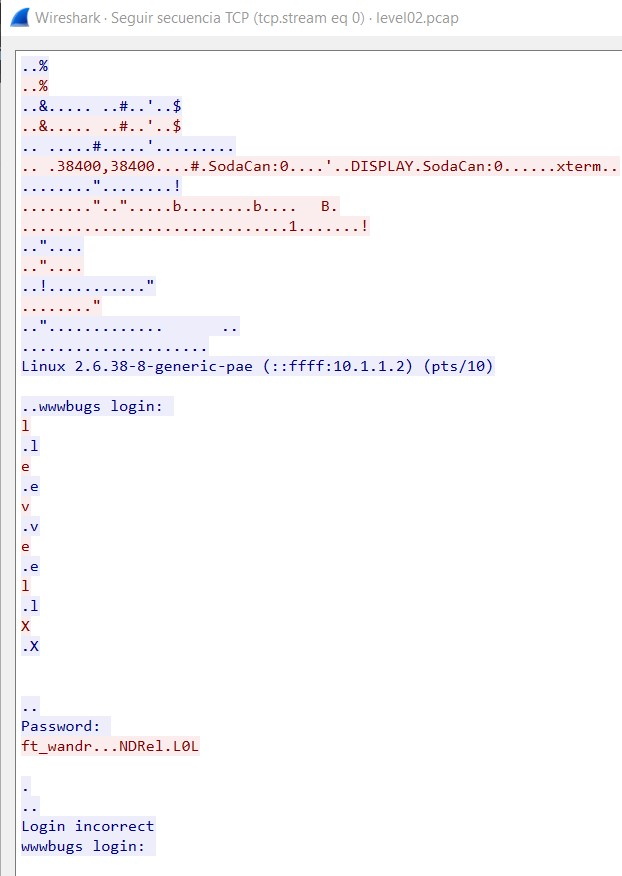

## Transfer the level02.pcap from VM to host system with scp
scp -P 4242 level02@(ip of your machine):/home/user/level02/level02.pcap .

## Use Wireshark to see TCP Data of level02.pcap
Click in any TCP log and use Ctrl + Alt + Shift + T to open TCP stream window

## Extract from TCP stream window the user and password
user: levelX -> flag02
Password: ft_waNDReL0L

## Access to user flag02 and get the password for user level03
su flag03 (password : ft_waNDReL0L)
getflag

-> kooda2puivaav1idi4f57q8iq